# linux-commander User Manual

> **linux-commander** — A dual-pane orthodox file manager for the terminal era, built with tkinter.

## Table of Contents

1. [Main Window](#main-window)
2. [Help Dialog (F1)](#help-dialog-f1)
3. [Theme Picker (Options > Theme)](#theme-picker-options->-theme)
4. [Font Picker — Main Panels (Options > Font)](#font-picker-—-main-panels-options->-font)
5. [Font Picker — Editor (Options > Editor Font)](#font-picker-—-editor-options->-editor-font)
6. [Font Picker — Viewer (Options > Viewer Font)](#font-picker-—-viewer-options->-viewer-font)
7. [FTP/SFTP Connections (Network > FTP/SFTP)](#ftp-sftp-connections-network->-ftp-sftp)
8. [New Connection (Network > FTP/SFTP > New...)](#new-connection-network->-ftp-sftp->-new...)
9. [Optional Dependencies (File > Optional Dependencies)](#optional-dependencies-file->-optional-dependencies)
10. [Plugin Status (File > Plugin Status)](#plugin-status-file->-plugin-status)
11. [Command Settings (Options > Command Settings)](#command-settings-options->-command-settings)
12. [New File Dialog](#new-file-dialog)
13. [Copy Dialog (F5)](#copy-dialog-f5)
14. [Move Dialog (F6)](#move-dialog-f6)
15. [Compression Dialog (Shift+F5)](#compression-dialog-shift+f5)
16. [Columns Dialog (Options > Columns)](#columns-dialog-options->-columns)
17. [Progress Dialog](#progress-dialog)
18. [Conflict Resolution Dialog](#conflict-resolution-dialog)
19. [Compare Files (Operations > Compare Files)](#compare-files-operations->-compare-files)
20. [Checksums (Operations > Checksums)](#checksums-operations->-checksums)
21. [Encrypt (Operations > Encrypt)](#encrypt-operations->-encrypt)
22. [Decrypt (Operations > Decrypt)](#decrypt-operations->-decrypt)
23. [Create Floppy Image (Operations > Create Floppy Image)](#create-floppy-image-operations->-create-floppy-image)

---

## Introduction

linux-commander is a dual-pane file manager in the tradition of Norton Commander, Midnight Commander,
and Total Commander. It features:

- **Dual-pane browsing** with keyboard-driven navigation
- **Built-in viewer/editor** (F3/F4) with syntax highlighting, hex dump, CSV/JSON table view
- **Archive browsing** for 12+ formats (zip, tar, 7z, rar, etc.) — press Enter to enter archives
- **File encryption** with ChaCha20-Poly1305
- **FTP/SFTP** remote connections
- **Background search** with archive descent (Alt+F7)
- **Plugin system** for extensibility

### Keyboard Conventions

| Key | Action |
|-----|--------|
| `Tab` | Switch active panel |
| `F1`–`F10` | Function key commands (shown in bottom bar) |
| `Alt`+`Key` | Menu shortcuts (underlined letters) |
| `Ctrl`+`Key` | Control shortcuts |
| `Shift`+`Key` | Extended functions |

---

## Main Window

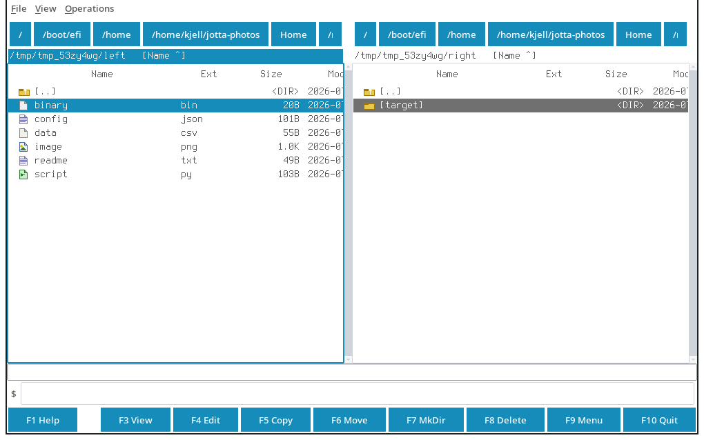

### Purpose

The primary application window featuring dual file panels, function key bar, menu bar, command prompt, and status bar.

### Key Features

- Dual file panels (left/right) with directory listings
- Function key bar (F1–F10) for common operations
- Menu bar with File, Options, Network, Operations, Help menus
- Command prompt for shell commands
- Status bar showing panel info, selection count, disk space
- Volume/drive selector (Linux: /proc/mounts based)

### Keyboard Shortcuts

- `Tab — Switch active panel`
- `F1 — Help`
- `F3 — View file`
- `F4 — Edit file`
- `F5 — Copy`
- `F6 — Move`
- `F7 — New directory`
- `F8 — Delete`
- `F9 — Menu bar`
- `F10 — Quit`
- `Alt+F7 — Search`
- `Ctrl+\ — Hotlist/Bookmarks`

### Usage

Navigate with arrow keys, Enter to enter directories, Tab to switch panels. Use F-keys for operations. Type commands in the command prompt at the bottom.

---

## Help Dialog (F1)

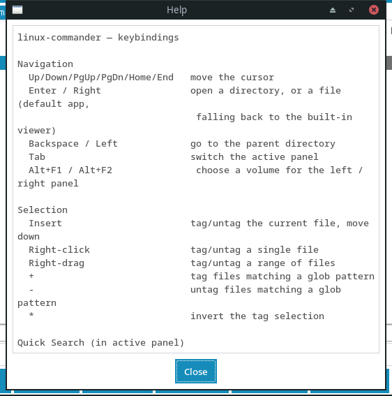

### Purpose

Displays keyboard shortcuts and command reference.

### Key Features

- Complete keybinding reference
- Scrollable text view
- Dismissible with Escape or Close button

### Keyboard Shortcuts

- `F1 — Open help`
- `Escape — Close`

### Usage

Press F1 anytime to see the full keyboard reference. Scroll with arrow keys or mouse wheel. Press Escape or click Close to dismiss.

---

## Theme Picker (Options > Theme)

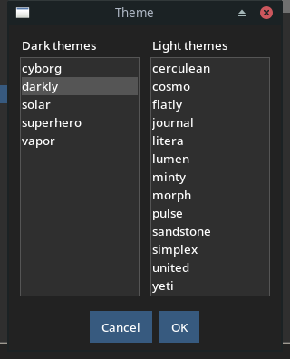

**Menu Path:** Options > Theme

### Purpose

Select application theme from ttkbootstrap's built-in themes with live preview.

### Key Features

- Two columns: Dark themes and Light themes
- Live preview on selection
- 30+ built-in themes (cosmo, flatly, lumen, darkly, cyborg, solar, etc.)
- Persists theme choice in settings

### Keyboard Shortcuts

- `Options > Theme`
- `Escape — Close`

### Usage

Open Options > Theme. Click a theme name to preview instantly. Click OK to apply, Cancel to revert. Current theme is highlighted.

---

## Font Picker — Main Panels (Options > Font)

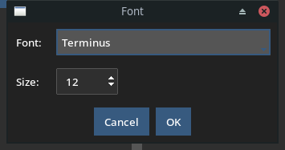

**Menu Path:** Options > Font

### Purpose

Configure font family and size for the main file panels with live preview.

### Key Features

- Font family dropdown (monospace fonts prioritized)
- Font size spinner (8-72pt)
- Live preview on selection change
- Applies to both panels, status bar, F-key bar
- Persists in settings

### Keyboard Shortcuts

- `Options > Font`
- `Escape — Cancel`

### Usage

Open Options > Font. Select font family and size. Preview updates live. Click OK to apply, Cancel to revert.

---

## Font Picker — Editor (Options > Editor Font)

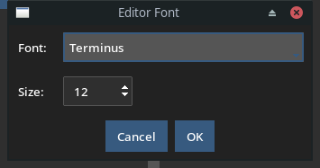

**Menu Path:** Options > Editor Font

### Purpose

Configure font for the editor window (F4).

### Key Features

- Separate font setting from main panels
- Monospace fonts prioritized
- Live preview
- Persists in settings

### Keyboard Shortcuts

- `Options > Editor Font`
- `Escape — Cancel`

### Usage

Open Options > Editor Font. Configure independently from main panel font. Useful for larger/smaller editor text.

---

## Font Picker — Viewer (Options > Viewer Font)

**Menu Path:** Options > Viewer Font

### Purpose

Configure font for the viewer window (F3).

### Key Features

- Separate font setting from main panels and editor
- Monospace fonts prioritized
- Live preview
- Persists in settings

### Keyboard Shortcuts

- `Options > Viewer Font`
- `Escape — Cancel`

### Usage

Open Options > Viewer Font. Configure independently. Useful for larger text in hex/CSV views.

---

## FTP/SFTP Connections (Network > FTP/SFTP)

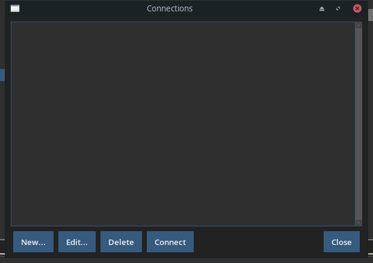

**Menu Path:** Network > FTP/SFTP Connections

### Purpose

Manage FTP and SFTP remote connections for browsing remote filesystems.

### Key Features

- Add/edit/delete connections
- Protocol: FTP, FTPS, SFTP
- Host, port, username, password/key
- Passive/active mode for FTP
- Key-based auth for SFTP
- Connection testing
- Mounts as virtual filesystem

### Keyboard Shortcuts

- `Network > FTP/SFTP Connections`
- `Escape — Close`

### Usage

Open Network > FTP/SFTP. Click Add to create new connection. Fill in details. Click Connect to test and mount. Remote paths appear in panel volume selector.

---

## New Connection (Network > FTP/SFTP > New...)

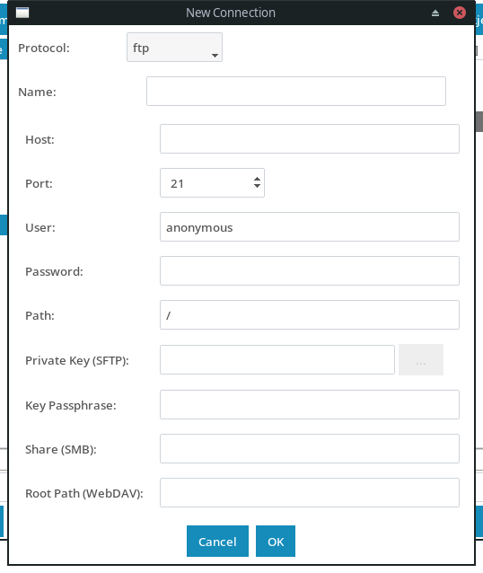

**Menu Path:** Network > FTP/SFTP > New...

### Purpose

Create a new FTP, FTPS, SFTP, SMB, WebDAV, or Jottacloud connection.

### Key Features

- Protocol selector: FTP, FTPS, SFTP, SMB, WebDAV, WebDAVS, Jottacloud
- Connection name
- Host, port (with default per protocol)
- Username (default: anonymous for FTP)
- Password field (hidden)
- Remote path (default: /)
- SFTP: Private key file with browse button
- SFTP: Key passphrase (optional)
- SMB: Share name
- WebDAV: Root path
- Jottacloud: Personal login token (get from https://www.jottacloud.com/web/secure)
- OK/Cancel buttons

### Keyboard Shortcuts

- `Network > FTP/SFTP > New...`
- `Escape — Cancel`

### Usage

In FTP Connections dialog, click New... Select protocol. Fill in host, port, user, password/key. For SFTP, optionally select private key file. For Jottacloud, enter login token. Click OK to save.

---

## Optional Dependencies (File > Optional Dependencies)

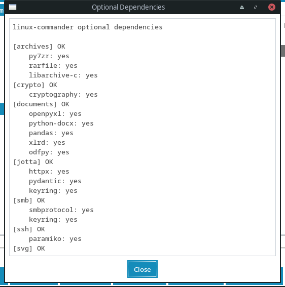

**Menu Path:** File > Optional Dependencies

### Purpose

View and install optional Python packages for extended functionality.

### Key Features

- Lists all optional dependency groups
- Shows install status (installed/missing)
- One-click install via pip
- Groups: archives, images, documents, crypto, etc.

### Keyboard Shortcuts

- `File > Optional Dependencies`
- `Escape — Close`

### Usage

Open File > Optional Dependencies. See which extras are installed. Click Install to add missing packages. Restart app to activate.

---

## Plugin Status (File > Plugin Status)

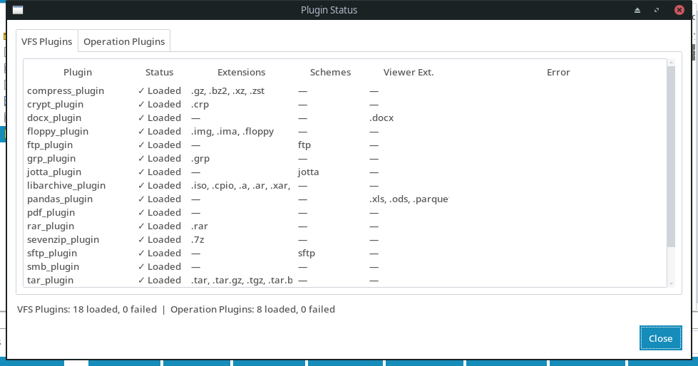

**Menu Path:** File > Plugin Status

### Purpose

View discovered VFS, viewer, sort, codec, and conflict plugins with their status.

### Key Features

- Lists all auto-discovered plugins
- Shows plugin type (VFS extension, VFS scheme, viewer, sort, codec, conflict)
- Shows supported extensions/schemes
- Highlights failed imports

### Keyboard Shortcuts

- `File > Plugin Status`
- `Escape — Close`

### Usage

Open File > Plugin Status to see all loaded plugins. Failed plugins show error details. Useful for debugging missing optional dependencies.

---

## Command Settings (Options > Command Settings)

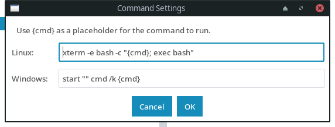

**Menu Path:** Options > Command Settings

### Purpose

Configure the terminal command used by the command prompt (F9 / Ctrl+Enter).

### Key Features

- Separate commands for Linux and Windows
- Placeholder {cmd} for the user's command
- Example: gnome-terminal -- bash -c '{cmd}; exec bash'

### Keyboard Shortcuts

- `Options > Command Settings`
- `Escape — Close`

### Usage

Open Options > Command Settings. Edit the template for your terminal emulator. The {cmd} placeholder is replaced with your typed command.

---

## New File Dialog

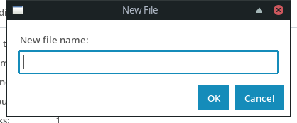

**Menu Path:** File > New

### Purpose

Create a new empty file and open it in the editor.

### Key Features

- Filename input with extension
- Opens directly in editor (F4)
- Creates parent directories if needed

### Keyboard Shortcuts

- `File > New`
- `F4 on empty selection (with prompt)`

### Usage

File > New. Enter filename. Press Enter to create and open in editor.

---

## Copy Dialog (F5)

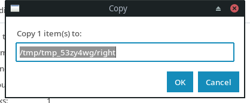

### Purpose

Copy selected files/directories to the target panel.

### Key Features

- Shows source and destination paths
- Overwrite options: skip, replace, compare, newer, rename
- Preserve timestamps option
- Follow symlinks option
- Progress dialog with cancel

### Keyboard Shortcuts

- `F5 — Copy`
- `Escape — Cancel`

### Usage

Select files, press F5. Choose overwrite strategy. Click OK to start copy. Progress dialog appears.

---

## Move Dialog (F6)

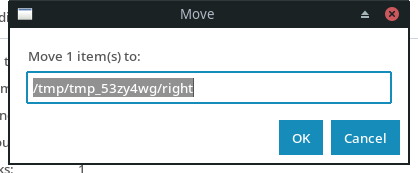

### Purpose

Move selected files/directories to the target panel.

### Key Features

- Same options as Copy dialog
- Source removed after successful move
- Cross-device moves (copy+delete)

### Keyboard Shortcuts

- `F6 — Move`
- `Escape — Cancel`

### Usage

Select files, press F6. Configure target and options. Progress dialog appears.

---

## Compression Dialog (Shift+F5)

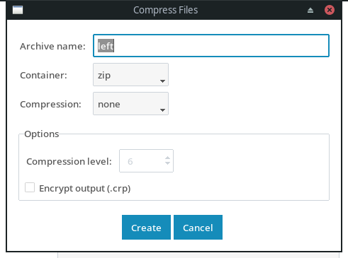

### Purpose

Create archives with container format, codec, level, and encryption.

### Key Features

- Container: zip, tar, 7z, grp, iso, etc.
- Codec: none, gzip, bzip2, xz, zstd
- Compression level (1-9, or 1-22 for zstd)
- Encryption: ChaCha20-Poly1305
- Encrypt file names (7z)
- Split archives (volume size)

### Keyboard Shortcuts

- `Shift+F5 — Compress`
- `Escape — Cancel`

### Usage

Select files, press Shift+F5. Choose container, codec, level. Enable encryption for .crp files. Click OK to create archive.

---

## Columns Dialog (Options > Columns)

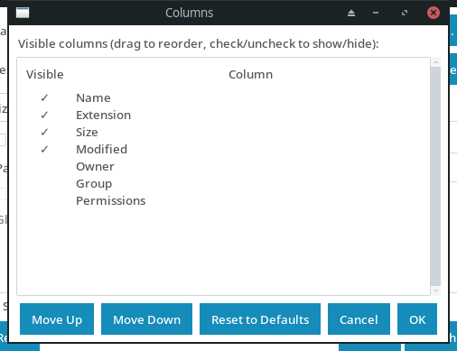

**Menu Path:** Options > Columns

### Purpose

Configure which columns are visible in file panels and their order.

### Key Features

- Available: Name, Size, Modified, Permissions, Owner, Group, Extension
- Drag to reorder (listbox with up/down buttons)
- Per-panel or global setting
- Persists in settings

### Keyboard Shortcuts

- `Options > Columns`

### Usage

Open Options > Columns. Use Up/Down buttons to reorder. Check/uncheck to show/hide columns. Applies to active panel or both.

---

## Progress Dialog

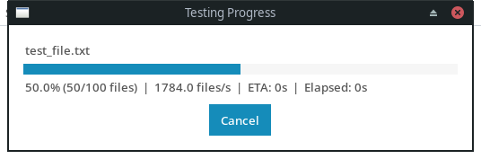

### Purpose

Shows progress for long-running operations (copy, move, compress, search) with cancel option.

### Key Features

- Progress bar with percentage
- Current file/item display
- Elapsed/remaining time estimate
- Cancel button (graceful abort)
- Auto-close on completion

### Keyboard Shortcuts

- `Escape — Cancel operation`

### Usage

Appears automatically during F5/F6/Shift+F5/Alt+F7 operations. Click Cancel to abort. Shows throughput and ETA.

---

## Conflict Resolution Dialog

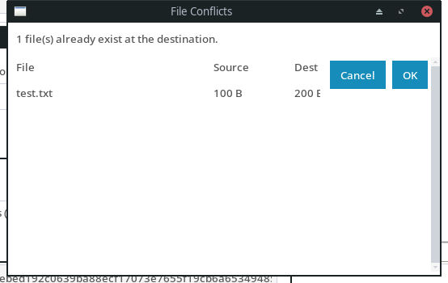

### Purpose

Resolve file conflicts during copy/move when destination exists.

### Key Features

- Strategies: Skip, Replace, Compare, Newer, Rename
- Apply to all checkbox
- Shows source vs dest size/date
- Preview mode for Compare

### Keyboard Shortcuts

- `Appears automatically during copy/move`
- `Escape — Cancel`

### Usage

Appears when copying/moving to a location with existing files. Choose strategy. 'Apply to all' uses same choice for remaining conflicts.

---

## Compare Files (Operations > Compare Files)

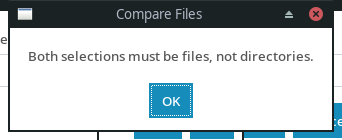

**Menu Path:** Operations > Compare Files

### Purpose

Compare two selected files side-by-side with differences highlighted.

### Key Features

- Side-by-side diff view
- Color-coded changes (added/removed/modified)
- Line numbers
- Sync scrolling

### Keyboard Shortcuts

- `Operations > Compare Files`
- `Escape — Close`

### Usage

Select exactly two files (one from each panel or two from same panel). Choose Operations > Compare Files. View differences. Double-click to open in diff viewer.

---

## Checksums (Operations > Checksums)

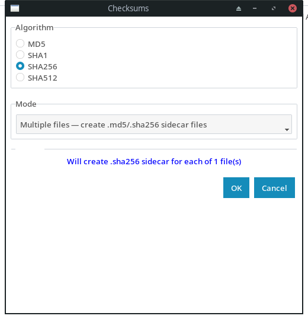

**Menu Path:** Operations > Checksums

### Purpose

Calculate and verify file checksums (MD5, SHA1, SHA256, etc.).

### Key Features

- Multiple algorithms: MD5, SHA1, SHA256, SHA512, BLAKE2
- Save to .md5/.sha1/.sha256 files
- Verify against existing checksum files
- Progress dialog with cancel

### Keyboard Shortcuts

- `Operations > Checksums`
- `Escape — Cancel`

### Usage

Select files. Choose Operations > Checksums. Select algorithm and options. Click OK to compute.

---

## Encrypt (Operations > Encrypt)

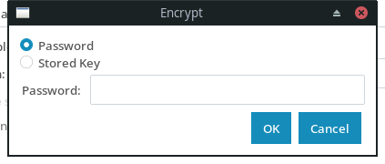

**Menu Path:** Operations > Encrypt

### Purpose

Encrypt selected files using ChaCha20-Poly1305.

### Key Features

- ChaCha20-Poly1305 authenticated encryption
- Password or stored key
- Creates .crp files
- Progress dialog with cancel

### Keyboard Shortcuts

- `Operations > Encrypt`
- `Escape — Cancel`

### Usage

Select files. Choose Operations > Encrypt. Enter password or choose stored key. Click OK to encrypt.

---

## Decrypt (Operations > Decrypt)

**Menu Path:** Operations > Decrypt

### Purpose

Decrypt .crp files using password or stored key.

### Key Features

- ChaCha20-Poly1305 decryption
- Password or stored key
- Restores original filename
- Progress dialog with cancel

### Keyboard Shortcuts

- `Operations > Decrypt`
- `Escape — Cancel`

### Usage

Select .crp files. Choose Operations > Decrypt. Enter password or choose stored key. Click OK to decrypt.

---

## Create Floppy Image (Operations > Create Floppy Image)

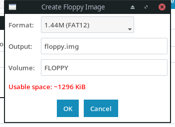

**Menu Path:** Operations > Create Floppy Image

### Purpose

Create a FAT12/FAT16 floppy disk image from selected files.

### Key Features

- 360KB, 720KB, 1.44MB, 2.88MB floppy images
- FAT12/FAT16 formatting
- Boot sector support
- Long filename (VFAT) support

### Keyboard Shortcuts

- `Operations > Create Floppy Image`
- `Escape — Cancel`

### Usage

Select files. Choose Operations > Create Floppy Image. Configure image size (360K/720K/1.44M/2.88M) and format. Click OK to create .img file.

---
